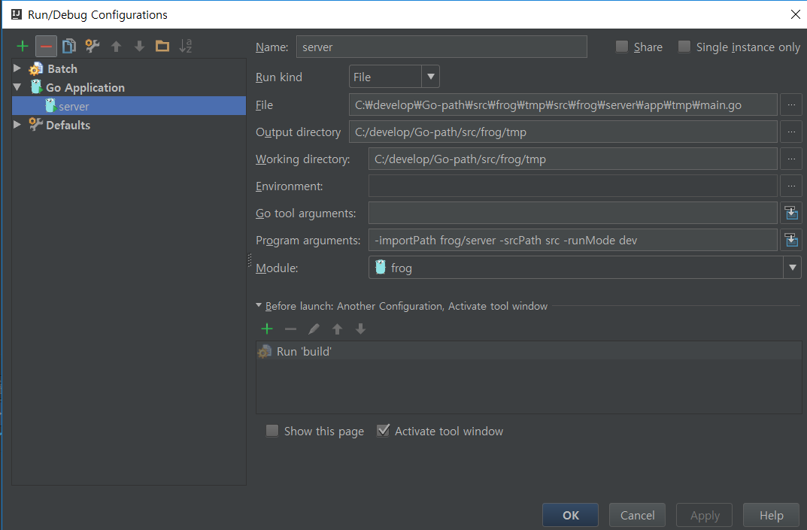

# Frog
Simple Go Web Application


[](https://travis-ci.org/voyageth/frog)

## Getting Started
### clone in $GO_PATH
```
cd $GO_PATH
git clone https://github.com/voyageth/frog.git github.com/voyageth/frog
```

### change directory
```
cd $GO_PATH/github.com/voyageth/frog
```

### setting conf file
```
cp server/conf/app.conf.sample server/conf/app.conf
```
#### edit app.conf
```
...
# Application
app.name = frog
app.secret = #Secret here#
...
db.spec = #userId:password:db-url#
...
```

### go get dependencies
```
go get -t github.com/revel/revel
go get -t github.com/revel/cmd/revel
go get -t github.com/go-gorp/gorp
go get -t github.com/go-sql-driver/mysql
go get -t golang.org/x/crypto/bcrypt
```

### build
```
revel build github.com/voyageth/frog/server tmp
```

## run application
```
revel run github.com/voyageth/frog/server dev 8080
```

## debug application in intellij
from http://brantiffy.axisj.com/archives/604


## Css Template
https://templated.co/ion

## License
Apache License, Version 2.0
http://www.apache.org/licenses/LICENSE-2.0
